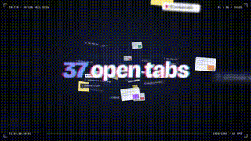
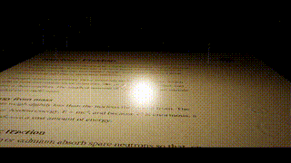

# Prompt Motion Library 🎬

A curated collection of 10 stunning motion video prompts and skills made with Claude Opus 5.5. 

All content is hosted directly in this repository for easy access by AI coding assistants (Claude, Codex, Antigravity) and for human inspiration.

*Special thanks to [prompt-motion.com](https://prompt-motion.com/) for curating these incredible examples.*

---

## 🎨 Showcase

### Pixel wizard crypto animation

**Prompt:**
> make a similar version but with a crypto reference

[View Details](prompts/0xevinho-3777d8.md) | ---

### Celld job ownership explainer

**Prompt:**
> make me an animation to explain why celld earns its place.

[View Details](prompts/0xnfrith-5be616.md) | ---

### Claude self-intro motion graphic

**Prompt:**
> make a dynamic 10-second motion graphics video that shows who are you as Opus 5.5 - be as creative and dynamic as possible. Avoid the frames and texts on the corners which are typical ai made giveaways!

[View Details](prompts/1littlecoder-9fef89.md) | ---

### Claude motion designer showreel

**Prompt:**
> Make a dynamic 15-second motion graphics video that shows what an incredible motion designer you are, like it's your showreel for a résumé. Go all out.

[View Details](prompts/3xtihor-0f6911.md) | ---

### Sketchbook animals come alive

**Prompt:**
> You are a professional videographer. Create me a high-definition, creative, playful, and joyful video that you enjoy watching, that has sounds matching the frames using JavaScript. Use as much as possible of the input images—hand-drawn—to make it more creative and more authentic from input-pictures. You can also be inspired by, but not copy, the videos created by you in video-examples/, especially this: video-examples/twitter_claude.mp4. You're really creative, so produce the best of what you can.

[View Details](prompts/abderrahmen-g-9e8ed0.md) | ---

### Fitters Bible app promo

**Prompt:**
> make a dynamic 15-second motion graphics video that shows what an incredible motion designer you are, like it's your showreel for a résumé. go all out. (About the pipefitters bible)

[View Details](prompts/adamdesgns-478d6d.md) | ---

### Trezio app motion reel

**Prompt:**
> Make a dynamic 15-second motion graphics video for Trezio app that shows what an incredible motion designer you are, like it's your showreel for a résumé. Get it!

[View Details](prompts/agonaliu-466a8f.md) | ---

### Distilbook promo showreel

**Prompt:**
> Make a dynamic 40-second motion graphics video on Distilbook that shows what an incredible motion designer you are, like it's your showreel - go all out. Use the Oppenheimer theme music as inspiration, but compose it yourself.

[View Details](prompts/ajith-io-4c248f.md) | ---

### Abstract motion design reel

**Prompt:**
> make a dynamic 15-second motion graphics video that shows what an incredible motion designer you are, like it's your showreel for a résumé. go all out.

[View Details](prompts/ajith-io-b5626e.md) | ---

### Anime robot combining sequence

**Prompt:**
> もしかしてロボットアニメみたいな3機の乗り物が変形合体してロボットになるシーンもアニメ風3D CGで作れますか。

[View Details](prompts/allforbigfire-86ff3c.md) | ---

